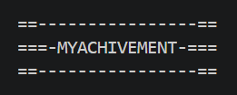
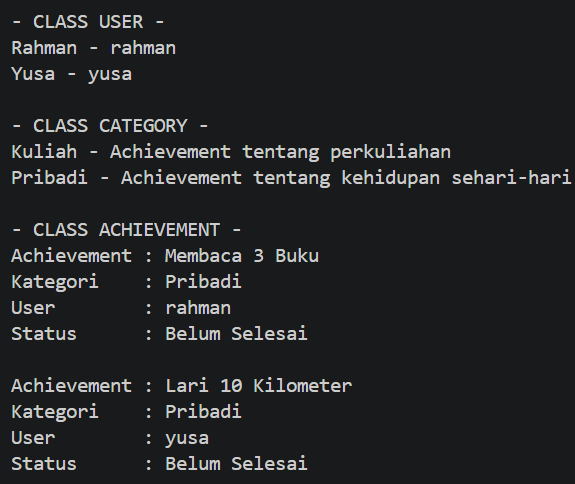
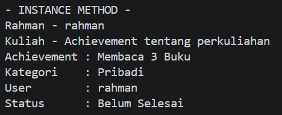
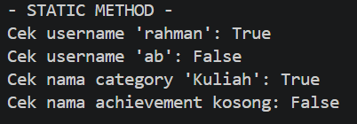
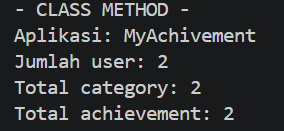
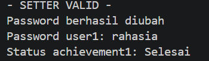
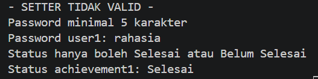

# MyAchivement

## Tentang Program

MyAchivement adalah program sederhana untuk mencatat pencapaian yang ingin atau sudah dicapai oleh pengguna. Program ini dibuat menggunakan konsep **Pemrograman Berorientasi Objek (OOP)** dengan bahasa Python.

Program ini memiliki tiga class utama, yaitu **User, Category, dan Achievement**. Class `User` digunakan untuk menyimpan data pengguna, `Category` digunakan untuk mengelompokkan pencapaian, sedangkan `Achievement` digunakan untuk menyimpan data pencapaian yang dimiliki oleh pengguna.

Selain membuat class, program juga menerapkan konsep **enkapsulasi**. Data yang dianggap penting dibuat sebagai atribut private, yaitu `__password` pada class `User` dan `__status` pada class `Achievement`. Atribut private tersebut diakses menggunakan getter dan diubah menggunakan setter yang sudah dilengkapi validasi.

Program juga menggunakan tiga jenis method, yaitu **instance method, class method, dan static method**. Semua jenis method tersebut diuji pada bagian akhir program. Selain itu, setter diuji menggunakan data yang valid dan tidak valid untuk melihat apakah validasinya berjalan dengan baik.

Program dibuat dengan alur yang sederhana agar mudah dipahami dan sesuai dengan materi dasar OOP yang digunakan pada praktikum.

---

## Struktur Class

Program MyAchivement memiliki tiga class utama yang saling berinteraksi.

### 1. Class User

Class `User` digunakan untuk menyimpan data pengguna.

Atribut yang digunakan:
- `nama` untuk menyimpan nama pengguna.
- `username` untuk menyimpan username.
- `__password` sebagai atribut private untuk menyimpan password.
- `nama_aplikasi` dan `jumlah_user` sebagai atribut class.

Method yang digunakan:
- `tampilkan()` untuk menampilkan data user.
- `info_aplikasi()` sebagai class method untuk menampilkan nama aplikasi dan jumlah user.
- `cek_username()` sebagai static method untuk mengecek username.
- `password` sebagai getter dan setter untuk mengakses dan mengubah password dengan validasi.

Pada program dibuat dua objek User, yaitu **Rahman** dan **Yusa**.

### 2. Class Category

Class `Category` digunakan untuk mengelompokkan achievement berdasarkan kategorinya.

Atribut yang digunakan:
- `nama` untuk menyimpan nama kategori.
- `deskripsi` untuk menyimpan penjelasan kategori.
- `nama_aplikasi` dan `jumlah_category` sebagai atribut class.

Method yang digunakan:
- `tampilkan()` untuk menampilkan data kategori.
- `total_category()` sebagai class method untuk menampilkan jumlah kategori.
- `cek_nama()` sebagai static method untuk mengecek nama kategori.

Pada program dibuat dua objek Category, yaitu **Kuliah** dan **Pribadi**.

### 3. Class Achievement

Class `Achievement` digunakan untuk menyimpan data pencapaian yang dimiliki oleh user.

Atribut yang digunakan:
- `nama` untuk menyimpan nama achievement.
- `kategori` untuk menghubungkan achievement dengan objek Category.
- `user` untuk menghubungkan achievement dengan objek User.
- `__status` sebagai atribut private untuk menyimpan status achievement.
- `status_default` dan `jumlah_achievement` sebagai atribut class.

Method yang digunakan:
- `tampilkan()` untuk menampilkan informasi achievement.
- `info_achievement()` sebagai class method untuk menampilkan jumlah achievement.
- `cek_nama()` sebagai static method untuk mengecek nama achievement.
- `status` sebagai getter dan setter untuk melihat serta mengubah status achievement dengan validasi.

Pada program dibuat dua objek Achievement, yaitu **Membaca 3 Buku** dan **Lari 10 Kilometer**.

Ketiga class tersebut saling berhubungan. Class `Achievement` menggunakan objek dari class `User` dan `Category`, sehingga setiap achievement memiliki pengguna dan kategori.

---

## Uji Program

Pengujian dilakukan pada bagian akhir program untuk memastikan setiap class dan method dapat berjalan sesuai fungsinya.

### 1. Pengujian Objek User, Category, dan Achievement

Pada bagian ini dibuat masing-masing dua objek dari setiap class. Hasilnya kemudian ditampilkan untuk memastikan data dari setiap objek berhasil dibuat.

**Keterangan:**  
Hasil program menunjukkan dua user yaitu Rahman dan Yusa, dua category yaitu Kuliah dan Pribadi, serta dua achievement yang berhasil ditampilkan. Achievement juga menunjukkan hubungan dengan user dan category.

---

### 2. Pengujian Instance Method

Instance method digunakan untuk menampilkan data dari masing-masing objek. Pada program, method `tampilkan()` digunakan pada class User, Category, dan Achievement.

**Keterangan:**  
Method `tampilkan()` berhasil menampilkan data dari objek yang dipanggil. Jadi setiap objek dapat menampilkan datanya sendiri.

---

### 3. Pengujian Static Method

Static method digunakan sebagai fungsi bantuan tanpa menggunakan `self` maupun `cls`.

**Keterangan:**  
Pada pengujian ini dilakukan pengecekan username, nama category, dan nama achievement. Hasil `True` berarti data memenuhi syarat, sedangkan `False` berarti data tidak memenuhi syarat.

---

### 4. Pengujian Class Method

Class method digunakan untuk mengakses informasi yang dimiliki bersama oleh seluruh objek dalam suatu class.

**Keterangan:**  
Hasil pengujian menampilkan nama aplikasi, jumlah user, jumlah category, dan jumlah achievement. Data tersebut berasal dari atribut class.

---

### 5. Pengujian Setter dengan Data Valid

Setter digunakan untuk mengubah atribut private melalui property. Pada bagian ini digunakan data yang sesuai dengan aturan yang sudah dibuat.

**Keterangan:**  
Password berhasil diubah menjadi `rahasia` karena memenuhi syarat minimal lima karakter. Status achievement juga berhasil diubah menjadi `Selesai`.

---

### 6. Pengujian Setter dengan Data Tidak Valid

Setelah data valid, setter diuji lagi menggunakan data yang tidak sesuai dengan aturan validasi.

**Keterangan:**  
Password `123` ditolak karena kurang dari lima karakter. Status `Sedang Berjalan` juga ditolak karena status yang diperbolehkan hanya `Selesai` dan `Belum Selesai`. Data sebelumnya tetap tersimpan.

---

## Kesimpulan

Program MyAchivement berhasil menerapkan konsep dasar OOP dengan menggunakan tiga class utama, yaitu User, Category, dan Achievement. Program juga sudah menerapkan atribut class, atribut instance, atribut public dan private, instance method, class method, static method, getter, setter, serta validasi data.

Pengujian dilakukan dengan membuat dua objek dari setiap class dan mencoba data yang valid maupun tidak valid. Dari hasil pengujian, fitur-fitur yang dibuat dapat berjalan sesuai dengan fungsi masing-masing.
