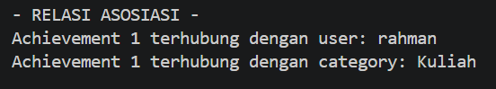
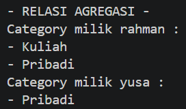
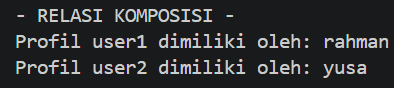
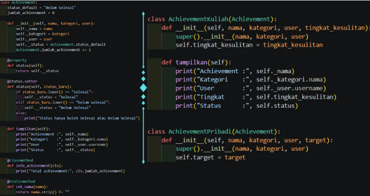

Ini merupakan lanjutan dari program **MyAchivement** yang sebelumnya sudah dibuat. Pada posttest ini, program dikembangkan lagi sesuai materi yang sudah dipelajari di kelas.

Ada 2 bagian utama yang diterapkan, yaitu:
* Relasi UML
* Inheritance

Pada relasi UML, program menerapkan **Asosiasi, Agregasi, dan Komposisi**.

Pada inheritance, program menggunakan **1 kelas induk dan 2 kelas turunan**, dilengkapi dengan `super()`, atribut tambahan, method overriding, serta penggunaan atribut protected dan private.

---

## 1. Relasi UML

### A. Asosiasi

Asosiasi diterapkan antara kelas **Achievement, User, dan Category**.

Achievement menyimpan data user yang memiliki achievement dan category yang digunakan oleh achievement tersebut.

Contohnya:

* Achievement berhubungan dengan User.
* Achievement berhubungan dengan Category.

Hubungan ini ditunjukkan pada saat program dijalankan.

Gambar 1. Penerapan relasi asosiasi pada program

---

### B. Agregasi

Agregasi diterapkan antara **User dan Category**.

User dapat mempunyai beberapa category yang dimasukkan ke dalam kumpulan category. Category sendiri tetap bisa berdiri sendiri dan tidak bergantung pada User.

Pada program, hubungan ini ditunjukkan saat category dimasukkan ke dalam User.

Gambar 2. Penerapan relasi agregasi pada program

---

### C. Komposisi

Komposisi diterapkan antara **User dan ProfilUser**.

Setiap User mempunyai ProfilUser yang dibuat saat object User dibuat. Jadi ProfilUser menjadi bagian dari User.

Pada program, hubungan tersebut ditunjukkan melalui data profil masing-masing user.

Gambar 3. Penerapan relasi komposisi pada program

---

## 2. Inheritance

Inheritance digunakan untuk membuat kelas turunan dari kelas **Achievement**.

Kelas yang digunakan yaitu:

* **Achievement** sebagai kelas induk.
* **AchievementKuliah** sebagai kelas turunan pertama.
* **AchievementPribadi** sebagai kelas turunan kedua.

Dengan inheritance ini, kedua kelas turunan bisa menggunakan atribut dan method yang sudah ada di kelas Achievement, kemudian menambahkan bagian yang sesuai dengan jenis achievement masing-masing.

Gambar 4. Superclass dan subclass pada program

---

## 3. Penerapan Ketentuan Inheritance

### A. Penggunaan super()

Kedua subclass memanggil konstruktor milik superclass menggunakan `super().__init__()`.

Tujuannya supaya data dasar dari Achievement tetap bisa digunakan oleh kelas turunannya.

Selain itu, setiap subclass juga mempunyai atribut tambahan yang berbeda.

---

### B. Method Overriding dan Tingkat Akses

Pada subclass **AchievementKuliah**, method `tampilkan()` dibuat kembali dengan perilaku yang berbeda dari method milik Achievement.

Selain itu, pada inheritance juga digunakan:

* `_nama`
* `_kategori`
* `_user`

sebagai atribut **protected**.

Sedangkan:

* `__status`
* `__password`

digunakan sebagai atribut **private**.

Dengan begitu, penerapan tingkat akses protected dan private tetap digunakan pada program.

Gambar 6. Method overriding serta penggunaan protected dan private

